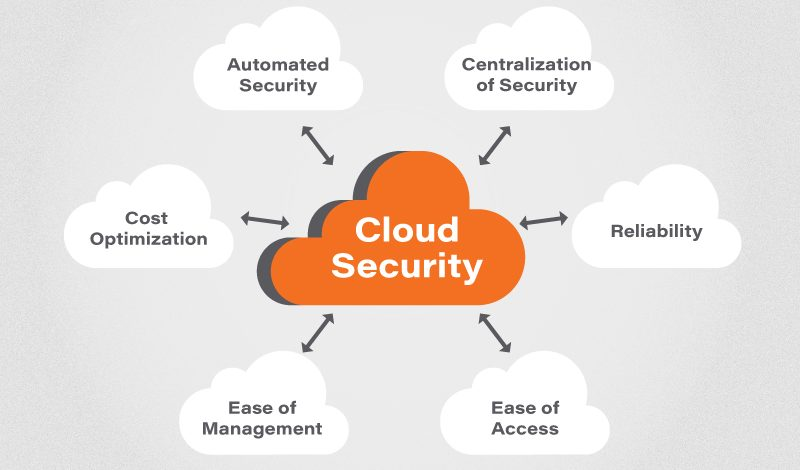

# Ασφάλεια στο cloud

* Όνομα: Ιωνάθαν Μπαξεβανίδης
* Μάθημα: Υπολογιστική Νέφους και Υπηρεσίες
* Τμήμα: Η3
* Ημερομηνία: 
---
 
## Πίνακας περιεχομένων
- [Ασφάλεια στο Cloud](#ασφάλεια-στο-cloud)
	- [Πίνακας περιεχομένων](#πίνακας-περιεχομένων)
	- [Εισαγωγή](#εισαγωγή)
	- [Τι είναι οι ασκήσεις red team](#τι-είναι-οι-ασκήσεις-red-team)
	- [Initial access σε περιβάλλον cloud μέσω Exploit Public-Facing Application](#initial-access-σε-περιβάλλον-cloud-μέσω-exploit-public-facing-application)
	- [Δραπέτευση απο περιβάλλον docker μέσω Malicious Image](#δραπέτευση-απο-περιβάλλον-docker-μέσω-malicious-image)
	- [Persistence μέσω Account Manipulation: SSH Authorized Keys](#persistence-μέσω-account-manipulation-ssh-authorized-keys)
	- [Data from Information Repositories: Code Repositories](#data-from-information-repositories-code-repositories)
	- [Μεταφορά και υποκλοπή δεδομένων (Transfer Data to Cloud Account/Data from Information Repositories: Code Repositories)](#Μεταφορά-και-υποκλοπή-δεδομένων-(Transfer-Data-to-Cloud-Account/Data-from-Information-Repositories:-Code-Repositories))
	- [Αντίμετρα και η χρήση ενός EDR solution](#Αντίμετρα-και-η-χρήση-ενός-EDR-solution)
	- [Demo](#Demo)
	- [Επιβλέποντας την υποδομή OKEANOS](#Επιβλέποντας-την-υποδομή-OKEANOS)
	- [Πηγές](#πηγές)

---

## Εισαγωγή
Σκοπός της εργασίας αυτής είναι η ανάδειξη ευπαθειών που μπορούν να υπάρξουν σε περιβάλλοντα υπολογιστικής νέφους καθώς και ο τρόπος ανίχνευσής τους και αντιμετώπισης. Παράλληλα θα αναπτυχθεί στο περιβάλλον του OKEANOS μια endpoint detection and response πλατφόρμα με την χρήση docker container και του elastic stack. Παράλληλα θα αναπτυχθεί η έννοια του endpoint detection and response και πως μια τέτοια λύση/πλατφόρμα μπορεί να προστατεύσει τα περιβάλλοντα cloud και τις εφαρμογές που εξυπηρετούν. Επίσης θα περιγραφεί και η δυνατότητα του scalability παράλληλα με την δυνατότητα του εύκολου deployment λόγο της χρήσης των docker containers.

## Τι είναι οι ασκήσεις red team
Στην περίπτωση red team άσκησης μια ομάδα από εξιδεικευμένους επαγγελματίες προσπαθούν να επιτύχουν ένα στόχο επιτιθόμενοι σε ένα δίκτυο ή μια υποδομή. Κατά κύριο λόγο τα red teams έχουν συγκεκριμένους στόχους οι οποίοι περιλαμβάνονται στο παρακάτω σχήμα και αυτοί είναι:
1.	Recon
2.	Initial Compromise
3.	Establish Persistence
4.	Escalate Privileges
5.	Exfiltrate and Complete mission

Κατά της ασκήσεις αυτές το red team προσπαθεί να εκτελέσει τον παραπάνω κύκλο χωρίς να γίνει αντιληπτό από τα συστήματα ασφαλείας που υπάρχουν στο εκάστοτε δίκτυο ή υποδομή. Πλέον που το Cloud σαν τεχνολογία έχει αναπτυχθεί σε τέτοιο βαθμό που μπορεί και υποστηρίζει ολόκληρες υποδομές τέτοιου είδους ασκήσεις γίνονται και σε cloud υποδομές. Στην επόμενη ενότητα θα περιγραφούν κάποιες τεχνικές για κάθε στάδιο μιας άσκησης red team σε περιβάλλον cloud. 

## Initial access σε περιβάλλον cloud μέσω Exploit Public-Facing Application
Οι υποδομές cloud πλέον λόγο της ευκολίας που παρέχουν καθώς και του scalability είναι μια από της καλύτερες λύσεις για να εξυπηρετηθεί μια οποιασδήποτε λειτουργικότητας εφαρμογή. Οι εφαρμογές αυτές πλέον παρόλο που περνάνε πολλούς ελέγχους μέσω διαδικασιών CI/CD και code testing της περισσότερες φορές είναι η κύρια ευπάθεια του συστήματος. Οι ευπάθειες αυτές μπορούν να εντοπιστούν από κακόβουλους χρήστες με αποτέλεσμα να δίνεται η δυνατότητα απομακρυσμένης μη εξουσιοδοτημένης πρόσβασης σε αυτούς τους κακόβουλους χρήστες. Όταν έχει επιτευχθεί αυτό ο κακόβουλος χρήστης έχει πλήρη έλεγχο του container μέσα στο οποίο τρέχει η εφαρμογή. Στην περίπτωση αυτή και αν το container έχει ρυθμιστεί σωστά ο κακόβουλος χρήστης δεν μπορεί να προχωρήσει στα παρακάτω βήματα μιας και βρίσκεται σε ένα εικονικό περιβάλλον το οποίο εύκολα μπορεί να καταστραφεί και να ξαναχτιστεί λόγο του docker. Σε κάθε άλλη περίπτωση ο κακόβουλος χρήστης μπορεί να ξεφύγει από το container είτε διαβάζοντας το file system του cloud host είτε με άλλες αντίστοιχες τεχνικές. Συνεπώς ένα καλά ρυθμισμένο docker container μπορεί να σταματήσει τέτοιου είδους επιθέσεις ελαχιστοποιώντας τις συνέπειες (impact) και βοηθά στην γρήγορη επαναλειτουργία της εφαρμογής.

## Δραπέτευση απο περιβάλλον docker μέσω Malicious Image
Ένας επίσης αρκετά συνηθισμένος τρόπος αρχικής πρόσβασης αλλά και δραπέτευσης απο περιβάλλον docker είναι και η δημιουργία κακόβουλων docker images. Από την στιγμή που θα εγκατασταθεί και θα τρέξει ένα τέτοιο image ουσιαστικά δίνει πλήρη έλεγχο στον κακόβουλο χρήστη να διαχειριστεί το container όπως ακριβώς αυτός θέλει. Επίσης σε αυτές τις περιπτώσεις δεν έχει εγκατασταθεί κάποιο solution ασφαλείας με αποτέλεσμα ο επιτιθέμενος να μένει κρυμμένος στο δικό του container εντός της cloud υποδομής.

## Persistence μέσω Account Manipulation: SSH Authorized Keys
   Σε αυτό το στάδιο ο επιτιθέμενος έχει καταφέρει να παραβιάσει την containered εφαρμογή και στόχος του είναι η επίτευξη μόνιμης πρόσβασης στην υποδομή cloud. Ένας από τους πλέον διαδεδομένους τρόπους απομακρυσμένης διαχείρισης cloud υποδομών καθώς και containers είναι το SSH τεχνική που χρησιμοποιήθηκε εκτενώς και στο εργαστήριο. Ο επιτιθέμενος θα προσπαθήσει να βρει ήδη ισχύοντα SSH keys από άλλους hosts είτε και από άλλα containers ώστε να μπορεί να διασφαλίσει την πρόσβασή του μέσω SSH ελαχιστοποιώντας έτσι την πιθανότητα να αποκαλυφθεί. Επίσης συνήθης τεχνική είναι και η δημιουργία νέων κλειδιών και η πρόσθεσή τους σε όλα τα containers και στις παραβιασμένες συσκευές της cloud υποδομής.

## Μεταφορά και υποκλοπή δεδομένων (Transfer Data to Cloud Account/Data from Information Repositories: Code Repositories)

Αυτό το στάδιο είναι το τελευταίο στάδιο της παραβίασης της υποδομής cloud και σκοπός είναι η υποκλοπή και μεταφορά δεδομένων. Αυτό μπορεί να επιτευχθεί με δύο τρόπους. Ο πρώτος είναι χρησιμοποιώντας τα ίδια τα repositories τα οποία υπάρχουν στις υποδομές αυτές. Στην περίπτωση του εργαστηρίου μια πρόσθεση ενός μη εξουσιοδοτημένου node θα μπορούσε να υποκλέψει όλα τα δεδομένα των μοιρασμένων repositories. Όμοια γίνεται και στην περίπτωση που υπάρξουν παραβιασμένα accounts. Ο επιτιθέμενος μεταφέρει τα υποβλεπόμενα στοιχεία σε άλλη απομακρυσμένη cloud υποδομή ή ακόμα και σε λογαριασμό που έχει προσθέσει ο ίδιος στην ήδη υπάρχουσα υποδομή cloud.

## Αντίμετρα και η χρήση ενός EDR solution
Ο πλέον αποτελεσματικός τρόπος για την αποφυγή παραβιάσεων είναι η σωστή ρύθμιση των υποδομών και η σωστή επίβλεψη (monitoring). Πλέον οι περισσότερες λύσεις για monitoring εξυπηρετούνται μέσω cloud υποδομών όπως το azure αλλά και το elastic stack με το οποίο θα ασχοληθούμε στο πρακτικό κομμάτι της εργασίας. Το elastic stack είναι μια πλατφόρμα SIEM (Security information and event management). Σε αυτή την πλατφόρμα έχουμε τον parent node στον οποίο φιλοξενείτε το elk instance που αποθηκεύει και επεξεργάζεται τα δεδομένα που του παρέχονται από τους hosts του δικτύου που θέλουμε να επιβλέπουμε. Η συγκεκριμένη υποδομή είναι πολύ εύκολο να στηθεί και έτσι συναντάτε συνήθως σε περιβάλλον cloud με την χρήση docker. Η υλοποίηση αυτή βοηθάει και στην επέκταση της υποδομής. Στην περίπτωση που θέλουμε να έχουμε ένα multi-node SIEM μπορούμε να μεταφέρουμε το docker instance στον άλλο cloud host και με ελάχιστες διορθώσεις στο configuration file να έχουμε scalability στο monitoring infrastructure.

Πλέον όμως η απλή επεξεργασία των δεδομένων δεν είναι αρκετή για την επαρκή κάλυψη των υποδομών. Για αυτό τον λόγο παρέχονται υπηρεσίες  Endpoint Detection and Response (EDR). Οι συγκεκριμένες λύσεις μπορούν να πάρουν άμεσες αποφάσεις μέσω αυτοματοποιημένων κανόνων ανίχνευσης απειλών μπλοκάροντας έτσι το μεγαλύτερο ποσοστό επιθέσεων μειώνοντας έτσι τον κίνδυνο κυβερνοεπιθέσεων. Σχετικά με το εργαστήριο το EDR μπορεί να ανιχνεύσει ένα κακόβουλο docker image και να το εμποδίσει αν εκτελεσθεί, μπορεί να ανιχνεύσει ένα κακόβουλο αρχείο που θα ανέβει σε ένα container, μπορεί να εντοπίσει επιθέσεις που γίνονται προς την υποδομή (πράγμα που παρατηρήθηκε για την υποδομή στον OKEANO) και όλα αυτά έχουν υλοποιηθεί σε ένα docker container με την χρήση του elastic security. 

Για τον σκοπό του εργαστηρίου έχει δημιοργιθεί elastic instance στην υπηρεσία OKEANOS η οποία έχει συνδεθεί με έναν windows host τον οποίο επιβλέπει μέσω της λειτρουργίας EDR.

## Περιγρφή του demo
Στο demo έχει στηθεί ένας κεντρικός node που είναι υπεύθυνος για το monitoring της υποδομής το οποίο βρίσκεται στον ΟΚΕΑΝΟ. Για την αποτελεσματική επίβλεψη καθώς και για την υλοποίηση του EDR έχει εγκατασταθεί ένας agent στον windows host οποίος μέσω κρυπτογραφημένου καναλιού επικοινωνεί με τον monitoring node στον ΟΚΕΑΝΟ. Η επικοινωνία αυτή περιλαμβάνει την μεταφορά event που γίνονται στον windows host καθώς και συνεχόμενο telemetry για την άμεση και γρήγορη αντιμετώπιση απειλών από το EDR. Ο host στον ΟΚΕΑΝΟ είναι ο fleet server που πάνω σε αυτόν θα συνδεθούν όλοι οι υπόλοιποι hosts.

Παρακάτω βλέπουμε την επικοινωνία του windows host με το elk stack στον OKEANO καθώς και τα σχετικά events που στέλνονται.

ΕΙΚΟΝΑ ΕΔΩ!

Και εδώ φαίνονται οι κανόνες με τους οποίους μέσω της ανταλλαγής telemetry μπορεί το EDR στον ΟΚΕΑΝΟ να δράσει κατάλληλα αποτρέποντας τις επιθέσεις.

ΕΙΚΌΝΑ ΑΠΟ ΤΑ RULES
 
---
## Πηγές
- [NVISO Security](https://blog.nviso.eu/2020/01/23/thoughts-on-red-team-nomenclature/)
- [Crowdstrike](https://www.crowdstrike.com/cybersecurity-101/red-team-vs-blue-team/)
- [Security Compass](https://www.securitycompassadvisory.com/blog/why-conduct-a-red-team-exercise/)
- [Imperva](https://www.imperva.com/blog/what-are-red-team-exercises-and-why-are-they-important/)
- [MITRE ATT&CK](https://attack.mitre.org/)
- [Exploit Public-Facing Application](https://attack.mitre.org/techniques/T1190/)
- [User Execution: Malicious Image](https://attack.mitre.org/techniques/T1204/003/)
- [Account Manipulation](https://attack.mitre.org/techniques/T1098/)
- [Account Manipulation: SSH Authorized Keys](https://attack.mitre.org/techniques/T1098/004/)
- [# Data from Information Repositories: Code Repositories](https://attack.mitre.org/techniques/T1213/003/)
- [# Transfer Data to Cloud Account](https://attack.mitre.org/techniques/T1537/)
- [Trellix](https://www.trellix.com/en-us/security-awareness/endpoint/what-is-endpoint-detection-and-response.html)
- [Crowdstrike](https://www.crowdstrike.com/cybersecurity-101/endpoint-security/endpoint-detection-and-response-edr/)
- [Elastic EDR](https://www.elastic.co/guide/en/security/current/install-endpoint.html)
- [TrendMicro](https://www.trendmicro.com/vinfo/it/security/news/virtualization-and-cloud/malicious-docker-hub-container-images-cryptocurrency-mining)
